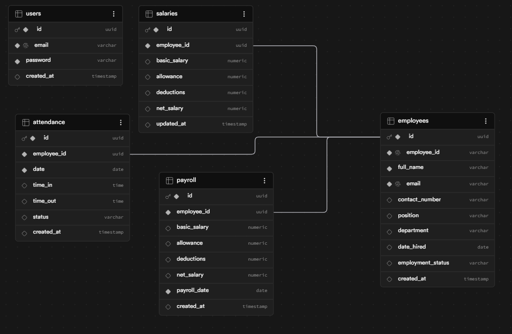
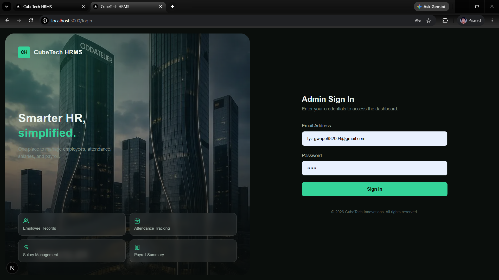
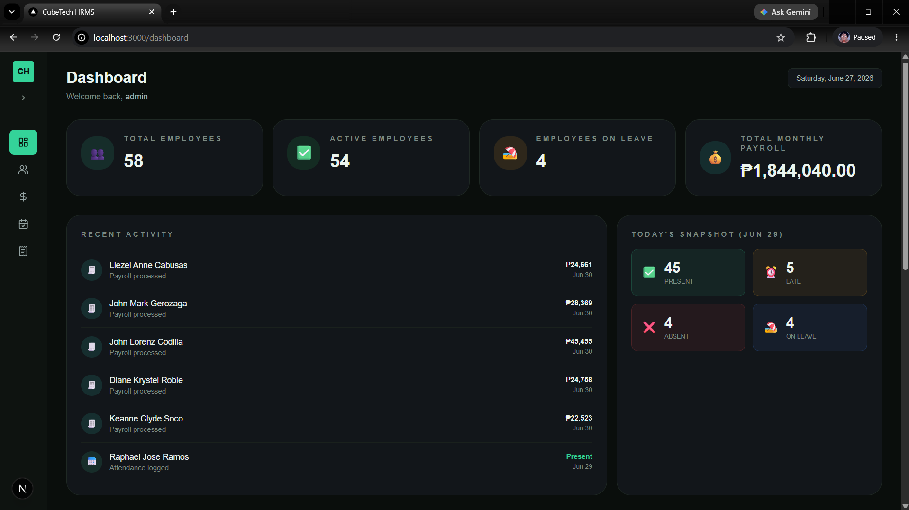
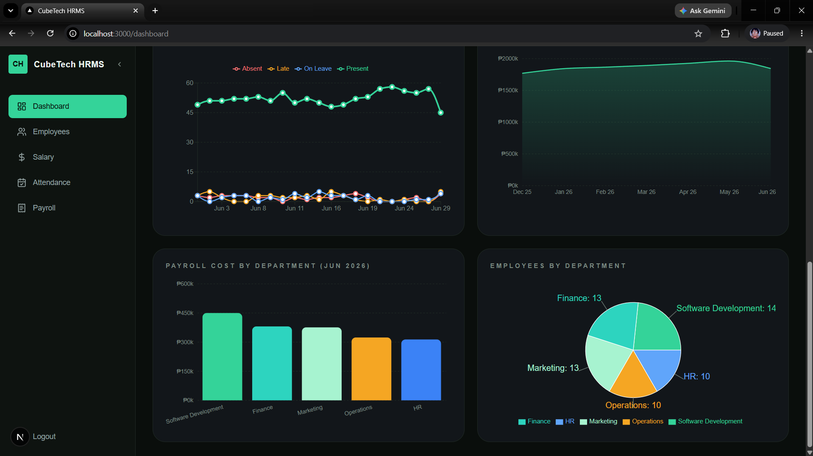
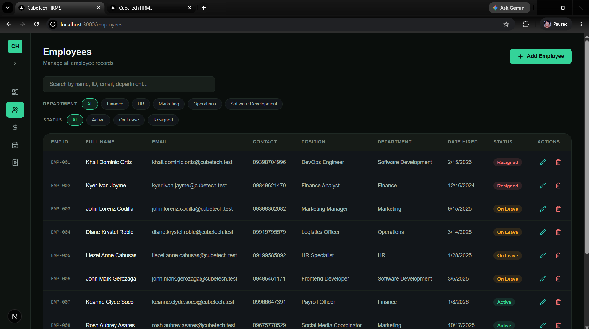
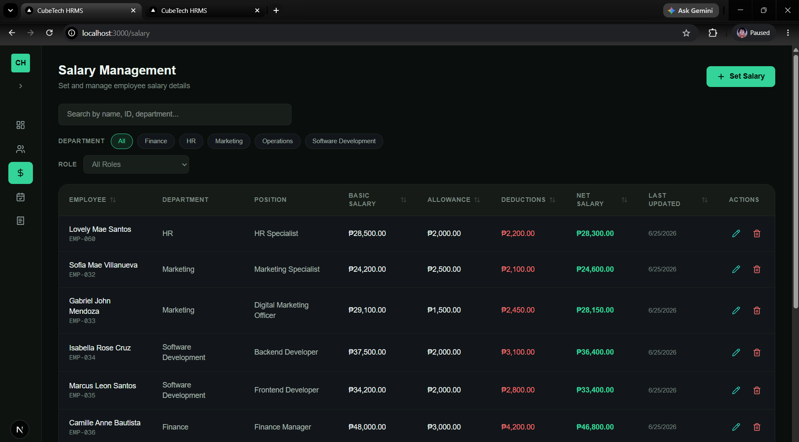
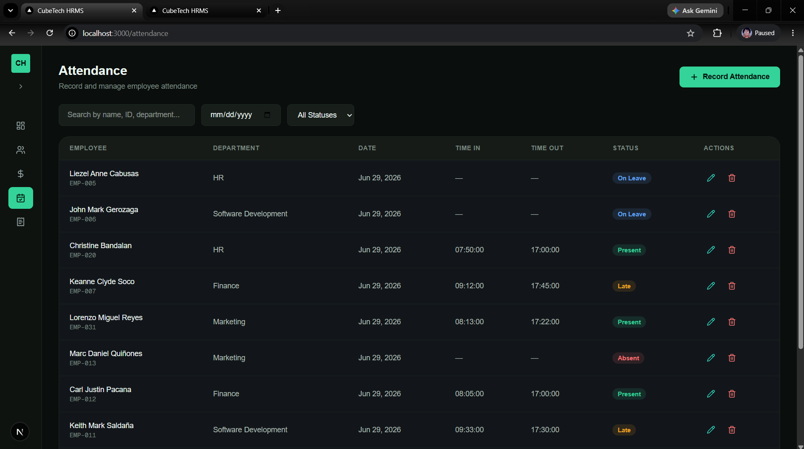
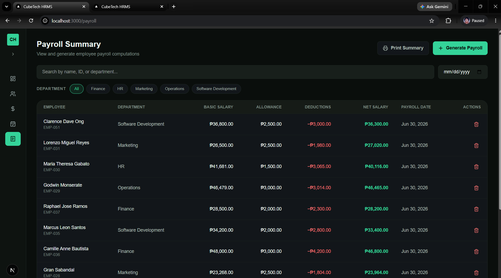

# Mini HRMS System
### CubeTech Innovations — Software Development Internship Assessment
**Submitted by:** Charles Benedict Boquecosa
**Deadline:** June 29, 2026

---

## Overview

The **Mini HRMS (Human Resource Management System)** is a web-based admin tool for managing core HR operations — employee records, attendance tracking, salary management, and payroll summaries — all in one place.

---

## Tech Stack

| Layer    | Technology            |
|----------|-----------------------|
| Frontend | React (Next.js)       |
| Backend  | Next.js API Routes    |
| Database | Supabase (PostgreSQL) |
| Styling  | Tailwind CSS          |

---

## Features Implemented

### 1. Login Page
Secure admin login using database-based authentication via Supabase.

**Default credentials:**
```
Email:    admin@test.com
Password: admin123
```

---

### 2. Employee Management
Full CRUD operations for employee records.

Each employee record includes:
- Employee ID, Full Name, Email, Contact Number
- Position, Department, Date Hired
- Employment Status (`Active`, `Resigned`, `On Leave`)

---

### 3. Salary Management
Admins can set and update salary details per employee.

**Fields:** Basic Salary, Allowance, Deductions, Net Salary

**Formula:**
```
Net Salary = Basic Salary + Allowance - Deductions
```

---

### 4. Attendance Tracking
Daily attendance recording per employee.

**Fields:** Employee Name, Date, Time In, Time Out, Status (`Present`, `Late`, `Absent`, `On Leave`)

---

### 5. Payroll Summary
Consolidated payroll view per payroll period, with a printable payroll summary.

**Displays:** Employee Name, Basic Salary, Allowance, Deductions, Net Salary, Payroll Date

---

### 6. Dashboard
At-a-glance overview including:
- Total Employees, Active Employees, Employees on Leave, Total Monthly Payroll
- Recent Activity feed
- Today's Attendance Snapshot
- Attendance Trend (past 30 days)
- Payroll Trend (last 6 months)
- Payroll Cost per Department
- Employee Count per Department

---

## API Endpoints

| Method | Endpoint              | Description              |
|--------|-----------------------|--------------------------|
| POST   | `/api/auth/login`     | Admin login              |
| GET    | `/api/employees`      | Get all employees        |
| POST   | `/api/employees`      | Add a new employee       |
| PUT    | `/api/employees/:id`  | Update employee record   |
| DELETE | `/api/employees/:id`  | Delete an employee       |
| POST   | `/api/salary`         | Add or update salary     |
| POST   | `/api/attendance`     | Record attendance        |
| GET    | `/api/payroll`        | Get payroll summary      |

All endpoints are implemented via Next.js API Routes under `/app/api/`.

---

## How to Run the Project

### 1. Clone the Repository

```bash
git clone https://github.com/WhiteBeardddd/CubeTech-HRMS.git
cd CubeTech-HRMS
```

### 2. Install Dependencies

```bash
npm install
```

### 3. Set Up Supabase

1. Create a free project at [https://supabase.com](https://supabase.com)
2. Go to **Settings → API** and copy your **Project URL** and **Anon Key**

### 4. Configure Environment Variables

Create a `.env.local` file in the root directory:

```env
NEXT_PUBLIC_SUPABASE_URL=your_supabase_project_url
NEXT_PUBLIC_SUPABASE_ANON_KEY=your_supabase_anon_key
```

### 5. Start the Development Server

```bash
npm run dev
```

Open [http://localhost:3000](http://localhost:3000) in your browser.

---

## Folder Structure

```
mini-hrms/
├── app/
│   ├── api/               # API routes (business logic)
│   ├── login/             # Login page
│   ├── dashboard/         # Dashboard overview
│   ├── employees/         # Employee management
│   ├── salary/            # Salary management
│   ├── attendance/        # Attendance tracking
│   └── payroll/           # Payroll summary
├── components/            # Reusable UI components
├── lib/                   # Supabase client setup
├── public/                # Static assets
└── .env.local             # Environment variables (not committed)
```

---
## Database Schema
 

 
---

## Screenshots

<table>
  <tr>
    <td align="center" width="50%">
      
      <br/>
      <b>Login Page</b>
    </td>
    <td align="center" width="50%">
      
      <br/>
      <b>Dashboard Overview</b>
    </td>
  </tr>
  <tr>
    <td align="center" width="50%">
      
      <br/>
      <b>Dashboard Analytics</b>
    </td>
    <td align="center" width="50%">
      
      <br/>
      <b>Employee Management</b>
    </td>
  </tr>
  <tr>
    <td align="center" width="50%">
      
      <br/>
      <b>Salary Management</b>
    </td>
    <td align="center" width="50%">
      
      <br/>
      <b>Attendance Tracking</b>
    </td>
  </tr>
  <tr>
    <td align="center" colspan="2">
      
      <br/>
      <b>Payroll Summary</b>
    </td>
  </tr>
</table>

---

## Author

**Charles Benedict Boquecosa**